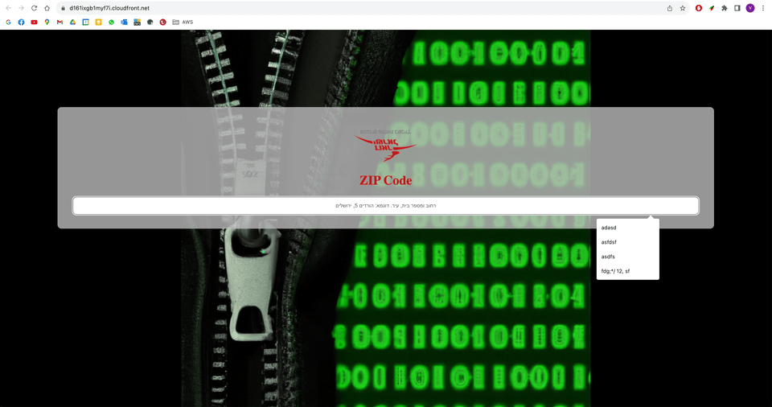

## Project Description
This project is my take on improving the (terrible) "find your Israeli ZIP code" UX of our beloved Israel Postal Services.
It is strictly educational, and I wrote it with learning IaC in mind, and TerraForm in particular. 

It creates AWS infrastructure that, given an address, allows you to find its matching Israeli ZIP code.
The UI is a React app, and the backend is a Python Lambda function that queries ElasticSearch.

The ES query is tolerant of typos and spelling mistakes, and works pretty well.

Infrastructure is created in AWS, and consists of (mainly, but not limited to):
- API Gateway
- EC2 instance running ElasticSearch 7.2 with [HebMorph plugin](https://github.com/synhershko/HebMorph) and Kibana (initialization is automated) in Docker containers
- Lambda function for querying
- CloudFront distribution
- Monitoring with CloudWatch

## Pre-requisites
* AWS account, and a user with sufficient permissions to run the TerraForm code
* TerraForm installed
* Python 3.10 (for the `push_zips_to_es.py` script)
* `aws` CLI installed and configured
* npx (for building the UI)

## How to set up
* `git clone` this repo
* `cd infrastructure`
* `terraform init`
* `terraform apply`
* Push data to ElasticSearch: Have a `zip-codes.csv` file in the root directory, `export ES_ENDPOINT=<IP>` (or use .env) the public IP of the EC2 instance, and run `python push_zips_to_es.py` (See [What's not included](#whats-not-included))
* Build the UI and push it to S3, allowing CloudFront to serve it:
  * Open the `SearchZipCodes.jsx` component and update API_URL to the API Gateway URL created by TerraForm.
  * Go to the UI directory, run `npm install` and `npm run build`
  * Copy the contents of the `build` directory to the S3 bucket created by TerraForm: `aws s3 sync ./build s3://<BUCKET_NAME> --profile <YOUR AWS PROFILE>`
  * For local development (only) of the UI and making actual requests, modify your hosts file: `sudo vim /etc/hosts` and add the following line: `127.0.0.1 d161ixgb1myf7i.cloudfront.net`, and create a cert.pem and key.pem files in the client dir. Remove once done.

## What's not included
The updated Israel Postal Services ZIP codes map is not available publicly. 
You can get a file with many of the addresses [here](https://www.odata.org.il/dataset/00a9749e-c112-4190-9c37-97918b5792cf).
Loading it into ElasticSearch is done with the `push_zips_to_es.py` script, that accepts the CSV file and the IP address of the EC2 instance, and bulk-pushes the data to ElasticSearch with Pandas.

### Acknowledgments
This project utilizes components from [elasticsearch-analysis-hebrew](https://github.com/Immanuelbh/elasticsearch-analysis-hebrew/). I'm grateful to the authors and contributors of that project for their work.
